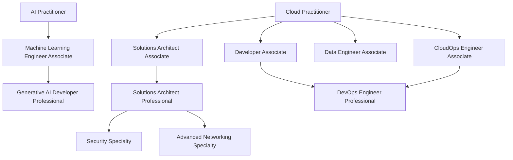

---
tags:
  - aws
  - certification
  - roadmap
  - obsidian
source: https://career.softserveinc.com/en-us/stories/complete-aws-certification-guide
created: 2026-04-14
---

# AWS Certification Hub

A visual, linked map of the AWS certification ecosystem, based on the SoftServe guide and cleaned up for Obsidian.

> [!success] Current primary plan
> Start with the AI track first.
>
> Recommended order:
> 1. [[AWS Certifications/02 - AWS Certified AI Practitioner]]
> 2. [[AWS Certifications/07 - AWS Certified Machine Learning Engineer - Associate]]
> 3. [[AWS Certifications/12 - AWS Certified Generative AI Developer - Professional]]
> 4. [[AWS Certifications/03 - AWS Certified Solutions Architect - Associate]]
>
> Study plan: [[AWS AI Certification Study Plan]]

## Quick links by level

### Foundational
- [[AWS Certifications/01 - AWS Certified Cloud Practitioner]]
- [[AWS Certifications/02 - AWS Certified AI Practitioner]]

### Associate
- [[AWS Certifications/03 - AWS Certified Solutions Architect - Associate]]
- [[AWS Certifications/04 - AWS Certified Developer - Associate]]
- [[AWS Certifications/05 - AWS Certified CloudOps Engineer - Associate]]
- [[AWS Certifications/06 - AWS Certified Data Engineer - Associate]]
- [[AWS Certifications/07 - AWS Certified Machine Learning Engineer - Associate]]

### Professional
- [[AWS Certifications/08 - AWS Certified Solutions Architect - Professional]]
- [[AWS Certifications/09 - AWS Certified DevOps Engineer - Professional]]
- [[AWS Certifications/12 - AWS Certified Generative AI Developer - Professional]]

### Specialty
- [[AWS Certifications/10 - AWS Certified Security - Specialty]]
- [[AWS Certifications/11 - AWS Certified Advanced Networking - Specialty]]

## Visual roadmap

## Best paths by goal

> [!info] General AWS / architecture path
> 1. [[AWS Certifications/01 - AWS Certified Cloud Practitioner]]
> 2. [[AWS Certifications/03 - AWS Certified Solutions Architect - Associate]]
> 3. [[AWS Certifications/08 - AWS Certified Solutions Architect - Professional]]
> 4. [[AWS Certifications/10 - AWS Certified Security - Specialty]] or [[AWS Certifications/11 - AWS Certified Advanced Networking - Specialty]]

> [!info] Developer / DevOps path
> 1. [[AWS Certifications/01 - AWS Certified Cloud Practitioner]]
> 2. [[AWS Certifications/04 - AWS Certified Developer - Associate]]
> 3. [[AWS Certifications/05 - AWS Certified CloudOps Engineer - Associate]]
> 4. [[AWS Certifications/09 - AWS Certified DevOps Engineer - Professional]]

> [!info] Data path
> 1. [[AWS Certifications/01 - AWS Certified Cloud Practitioner]]
> 2. [[AWS Certifications/06 - AWS Certified Data Engineer - Associate]]
> 3. [[AWS Certifications/03 - AWS Certified Solutions Architect - Associate]]

> [!tip] AI / ML / GenAI path (primary)
> 1. [[AWS Certifications/02 - AWS Certified AI Practitioner]]
> 2. [[AWS Certifications/07 - AWS Certified Machine Learning Engineer - Associate]]
> 3. [[AWS Certifications/12 - AWS Certified Generative AI Developer - Professional]]
> 4. [[AWS Certifications/03 - AWS Certified Solutions Architect - Associate]]
>
> Why this order:
> - AI Practitioner builds the language and AWS AI service map.
> - ML Engineer Associate gives the engineering depth.
> - GenAI Developer Professional becomes much easier after that base.
> - Solutions Architect Associate rounds out real-world system design later.

## How to use this vault section

- Use this note as the map.
- Start with [[AWS AI Certification Study Plan]].
- Open each certification note for focus areas, exam shape, and prep advice.
- Keep the detailed article summary in [[AWS Certification Roadmap]].

## Suggested order for a senior engineer

> [!success] Recommended sequence
> [[AWS Certifications/03 - AWS Certified Solutions Architect - Associate]] -> [[AWS Certifications/04 - AWS Certified Developer - Associate]] or [[AWS Certifications/05 - AWS Certified CloudOps Engineer - Associate]] -> [[AWS Certifications/08 - AWS Certified Solutions Architect - Professional]] -> [[AWS Certifications/10 - AWS Certified Security - Specialty]]
